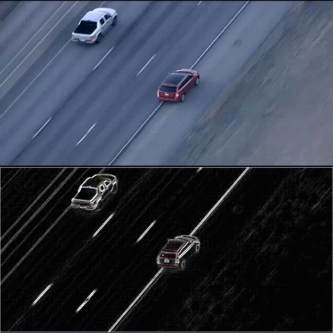

# Derivada
 Existem vários métodos para detectar bordas em imagem, como cany threshold e outros. Esses métodos são sensíveis a variação luminosa o que pode ser inviável em algumas aplicações em vídeo.
 
 Geralmente as borda do objeto possui as maiores variação de pixel. Assim, podemos detectar bordas usando derivada.
A função `Sobel` do Opencv faz esse cálculo.


> :pushpin: Dependência
* Python3
* python-opencv


 


## Descrição
Esse video foi construído a partir se uma sequência de imagem desse local [Dataset](http://www.dabi.temple.edu/~hbling/data/TColor-128/seqs/Carchasing_ce4.zip) 26.1Mbs.

> :pushpin:  Primeiro contruimos um laço for que percorre a lista de imagens usada.
No segundo passo calculamos a derivada em relação a x e a y separada.

```
grad_x = cv2.Sobel(frame, ddepth, 1, 0,ksize=3, scale=scale, delta=delta, borderType=cv2.BORDER_ISOLATED)
grad_y = cv2.Sobel(frame, ddepth, 0, 1, ksize=3, scale=scale, delta=delta, borderType=cv2.BORDER_ISOLATED)

```

* src	Image de entrada.
* ddepth	formato de saida
* dx	Ordem da derivada em x.
* dy	Ordem da derivada e y.
* ksize	Tamanho do Kernel (1,3,5 ou 7)
* scale	Fator de escala (opicional)
* delta	valor somado em dst no final do calculo.
* borderType	método de interpolação

> :pushpin:  Nas proximas linhas convertemos para escala uint8.

```
abs_grad_x = cv2.convertScaleAbs(grad_x)
abs_grad_y = cv2.convertScaleAbs(grad_y)

```
